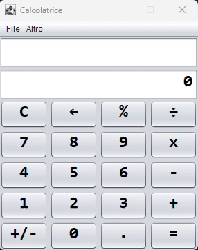

<!-- omit from toc -->
# Calcolatrice.java

Questa è una semplice calcolatrice sviluppata in Java con NetBeans e offre le basilari funzioni per eseguire semplici calcoli.

L'interfaccia grafica è molto intuitiva, ben organizzata e semplice da usare, oltre alle classiche funzioni, questa calcolatrice offre inoltre la possibilità di poter salvare in un file di testo esterno la cronologia dei calcoli effettuati.

Dietro l'interfaccia grafica scritta in Java Swing risiede una robusta codebase che gestisce tutte le eccezioni del caso, offrendo massima affidabilità e correttezza dei risultati. 

    

<!-- omit from toc -->
## Tabella dei contenuti
- [Installazione](#installazione)
- [Funzionalità](#funzionalità)
- [Documentazione](#documentazione)

## Installazione

L'installazione di questa calcolatrice prevede una versione del _[Java Runtime Environment (JRE)](https://www.java.com/it/download)_ installata sul dispositivo, una volta installato il _JRE_ è possibile trovare il più recente file _jar_ nell'ultima release di questa repository, una volta scaricato anche il file _jar_ non è più necessaria alcuna configurazione, basta solo eseguire il programma e tutto funzionerà correttamente.

## Funzionalità

Oltre le funzioni base di una normalissima calcolatrice, questa permette inoltre:
- interazione via tastierino numerico
- esecuzione di calcoli in modo continuo: premendo ripetutamente il pulsante "uguale" della calcolatrice oppure `[=]` dal tastierino numerico, sarà possibile rieseguire lo stesso calcolo sul risultato ottenuto
- la memorizzazione della cronologia dei calcoli effettuati in un file di testo esterno: premendo la combinazione di tasti `[Ctrl]+[S]` o premendo il pratico pulsante nel menù a tendina "File"

## Documentazione 

E' possibile consultare la documentazione del codice sorgente della calcolatrice dalla [wiki della repository](#)